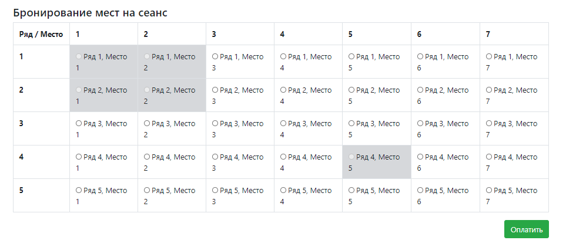
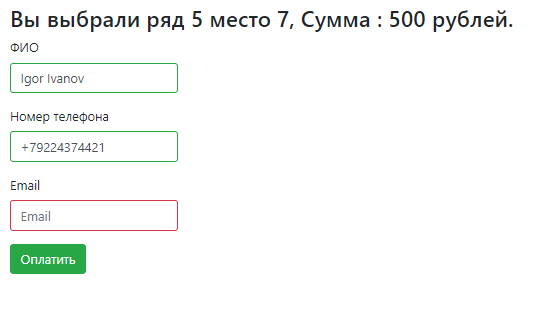

## Cinema ticket purchase service  
 

###### Service functionality:
- The user can choose a seat;  
- Each seat in the cinema has a status of occupied/vacant;  
- The user can pay for the seat by entering his name, email and phone number;  

###### User interface:
- Main window:  

- Payment window:  
 
- Payment window (success):  
  
- Payment window (fail):  
  
