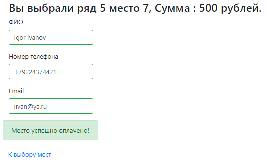
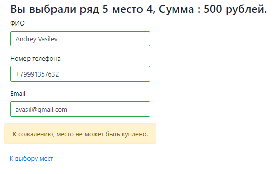

## Cinema ticket purchase service  
  

___
#### Service functionality
- Choosing a vacant seat in the cinema hall    
- Purchasing the seat  
- Checking whether the seat was purchased during the payment     

#### Technologies  
- JDBC (PostgreSQL)
- JAVA servlets/JSTL
- Bootstrap
- JS/JQuery/AJAX
- Slf4j
- Travis CI

#### User interface
- Main window:  

- Payment:  
 
- Successful payment:  
  
- Failed payment:  
  

#### Configure and install
1. Create a DB, run _./src/main/resources/scheme.sql_ script on it.  
2. Set your DB's parameters in _./src/resources/db.properties.

Deploy the WAR file to Tomcat:
1. Build the project.
2. Copy the war file to the Tomcat/webapps directory. 
